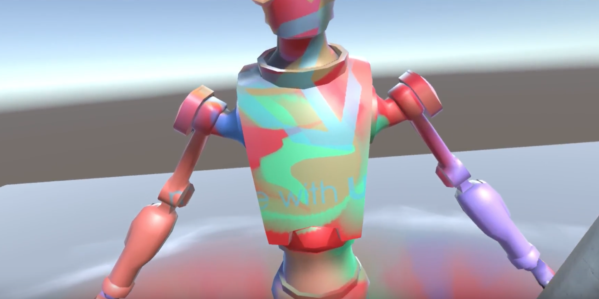

# ProjectionSprayの紹介

## はじめに

こんにちは！すぎのひろのりです！では残念ながらありません。

締め切りも近づいてきたある日、「すぎっちょ記事書いてる？」と問うたところ「あ！」とだけおっしゃり、どうやら完全に失念されておったようです。最近忙しそうなのですが、せっかくのこの機会、彼の実績を紹介したいのもあり、ここは簡単に代筆でお送りします。

### ProjectionSpray
すぎっちょは制作物をGithubに積極的に公開しており、その中でも個人的に面白いなと思ったのがこちらです。

[https://github.com/sugi-cho/ProjectionSpray](https://github.com/sugi-cho/ProjectionSpray)

3Dモデルにスプレーを吹きかけるようにして色をつけることができます。

#### デモ画像

スプレーデバイスからスプレーが噴出し、ボディの表面に色が塗られます。

謎のフェチズムを感じます。

ステンシルのようなことも！

Unity！

## まとめ

次回があれば、是非とも詳しい解説をお願いしたいものです。

すぎっちょが、面接時、自分と、似たものを、感じる、と言っていた同僚の仲田さんのリポジトリも、Unityの便利で優れたコードが多数あげられておりおすすめです。

[https://github.com/nobnak](https://github.com/nobnak)

失礼いたしました。

(｡･ˇ_ˇ･｡)